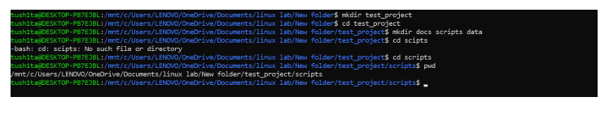
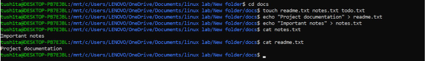
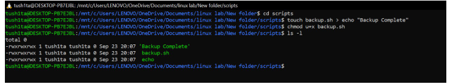
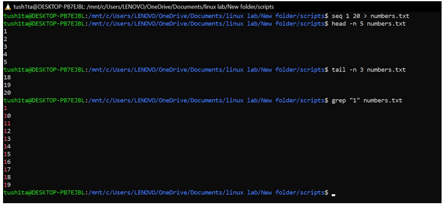
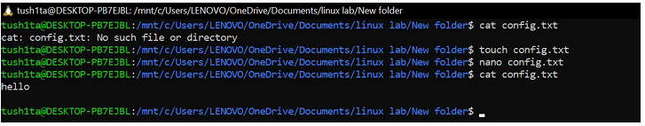
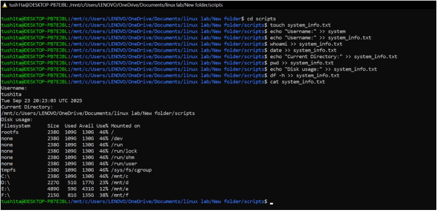
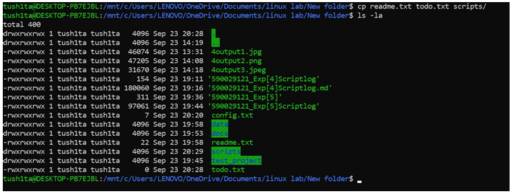
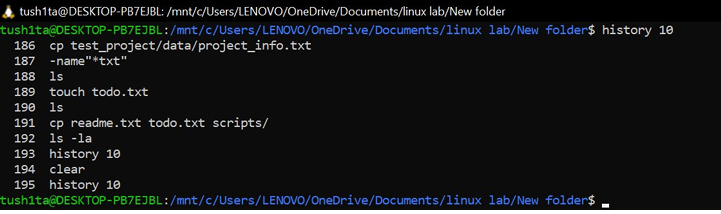
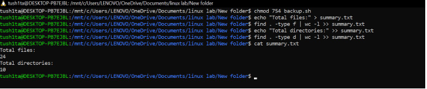

## Experiment [2]: [Linux file systems permissions and essential commands]

### Name: Tushita Sharma Roll.: 590029121 Date: 2025-09-19

### AIM:

* [To Learn linux file systems permissions and essential commands]

### Requirements:

* [Any Linux Distro, any kind of text editor (vs code, vim, notepad, nano, etc)]

### Theory:

* [Basic Linux file systems permissions and essential commands]

## Procedure & Observations

## TASK 1: [Directory Navigation]

## Task Statement:

* [Create a directory called test_project in your home directory, then create subdirectories docs, scripts, and data inside it. Navigate to the scripts directory and display your current path.]

## Explanation:

* [ Use mkdir to create the wanted directory we can use cd to navigate and use pwd to show current path ]

## Command(s):

```
mkdir test_project
cd test_project
mkdir docs, scripts, data
cd scipts
pwd     
```

Output: 

### Output:
<p align="center">

</p>


## TASK 2: [FIle Creation and Content]

## Task Statement:

* [Create three files in the docs directory: readme.txt, notes.txt, and todo.txt. Add the text "Project documentation" to readme.txt and "Important notes" to notes.txt. Display the contents of both files.]

## Explanation:

* [We can use touch to create empty files and using echo "text" > file.txt to add content to a file and using cat to display file contents]

## Command(s):

    cd docs 
    touch readme.txt notes.txt todo.txt 
    echo "Project documentation" > readme.txt
    echo "Important notes" > notes.txt
    cat notes.txt
    cat readme.txt

### Output:



## TASK 3: [FIle Operations]

## Task Statement:

* [Copy readme.txt to the data directory and rename the copy to project_info.txt. Then move todo.txt from docs to scripts directory.]

## Explanation:

* [- We can use the cp source destination to copy files and using the mv oldname newname to rename files also using the same command mv file directory/ to move files to another directory we can also combine copy and rename: cp file.txt newdir/newname.txt]

## Command(s):

    cp readme.txt data/project_info.txt

Output: 


## TASK 4: [FIle Permissions]

## Task Statement:

* [Create a shell script file called backup.sh in the scripts directory. Add the content #!/bin/bash and echo "Backup complete" to it. Make the file executable only for the owner.]

## Explanation:

* [Using chmod u+x filename we can make the file executable for user only using ls -l to check for permissions also script files typically need executable permission to run]

## Command(s):

```
cd scripts 
touch backup.sh > echo "Backup complete"
chmod u+x backup.sh
```


Output:




## TASK 5: [FIle Viewing]

## Task Statement:

* [Create a file called numbers.txt with numbers 1 to 20 (each on a new line). Display only the first 5 lines, then only the last 3 lines, then search for lines containing the number "1".]

## Explanation:

* [ I can quickly generate a list of numbers by running seq 1 20 > numbers.txt. To check the first few numbers, I use head -n 5 to see the first 5 lines, and tail -n 3 to see the last 3 lines. If I want to find all numbers containing a “1”, I can use grep "1". Alternatively, I could create the list manually by using multiple echo commands.]

## Command(s):

    seq 1 20 > numbers.txt
    head -n 5
    tail -n 3
    grep "1"

### Output:




## TASK 6: [Text Editing]

## Task Statement:

* [Using nano, create a file called config.txt with the following content:

Database=localhost Port=5432 Username=admin <pre>

</pre> Save the file and then display its contents.]

## Explanation:

* [I open a file in Nano using nano filename.txt and type my content normally. Once I’m done, I press Ctrl+O to save the file and Ctrl+X to exit Nano. After that, I use cat to check the contents and make sure everything was saved correctly.]

## Command(s):

    vim config.txt
    cat config.txt

Alternatively 

```
nano config.txt
cat config.txt
```

### Output:




## TASK 7: [System Information]

## Task Statement:

* [Create a file called system_info.txt that contains: your username, current date, your current directory, and disk usage information in human-readable format.]

## Explanation:

* [I can use whoami to check my username, date to see the current date, and pwd to know my current directory. To check disk usage, I use df -h. I can save the output of any command to a file by using redirection like command >> filename.txt. If I want to add labels, I use echo like this: echo "Username:" >> file.txt.]

## Command(s):

    cd scripts
    touch system_info.txt
    echo "Username:" >> system_info.txt
    whoami >> system_info.txt
    echo "Date:" >> system_info.txt
    date >> system_info.txt
    echo "Current Directory:" >> system_info.txt
    pwd >> system_info.txt
    echo "Disk Usage:" >> system_info.txt
    df -h >> system_info.txt

### Output:




## TASK 8: [File Organisation]

## Task Statement:

* [In your test_project directory, create a backup folder. Copy all .txt files from all subdirectories into this backup folder. Then list all files in the backup folder with detailed information.]

## Explanation:

* [I can use find . -name "*.txt" to locate all .txt files. Alternatively, I can navigate to each directory and copy files manually. To copy multiple files at once, I use cp file1.txt file2.txt destination/. If I want detailed information about the files, I use ls -la. The wildcard *.txt helps me match all files that end with .txt.]

## Command(s):

    cp test_project/data/project_info.txt    test_project/docs/notes.txt    test_project/docs/readme.txt    test_project/docs/todo.txt    test_project/scripts/config.txt    test_project/scripts/numbers.txt    test_project/scripts/system_info.txt    test_project/scripts/todo.txt    backup/

### Output:




## TASK 9: [Process and History]

## Task Statement:

* [Display your command history and count how many commands you've executed. Then show the top 10 most recent commands.]

## Explanation:

* [I can use history to see all the commands I’ve typed. To count the total number of commands, I use history | wc -l. If I want to view just the last 10 commands, I can use history 10 or history | tail -10. The wc -l command simply counts the number of lines in the output.]

## Command(s):

    history 10

### Output:



## TASK 10: [Comprehensive Cleanup]

## Task Statement:

* [Set the permissions of your backup.sh script to be readable, writable, and executable by owner, readable and executable by group, and readable by others. Then create a summary file that lists the total number of files and directories in your entire test_project.]

## Explanation:

* [I can set permissions for backup.sh using chmod 754 backup.sh to give rwxr-xr-- permissions. Alternatively, I can use chmod u=rwx,g=rx,o=r backup.sh. To count all files, I use find . -type f | wc -l, and to count directories, I use find . -type d | wc -l. If I want to see the full directory structure recursively, I use ls -R. I can also combine multiple commands with && or save the outputs to a summary file for later reference.]

## Command(s):

    chmod 754 backup.sh
    
    
    echo "Total files:" > summary.txt
    find . -type f | wc -l >> summary.txt
    echo "Total directories:" >> summary.txt
    find . -type d | wc -l >> summary.txt


### Output:


