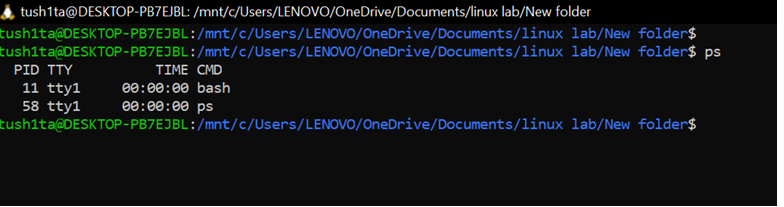
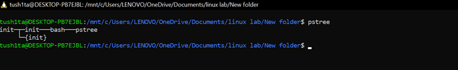
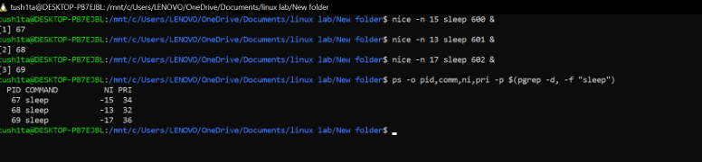
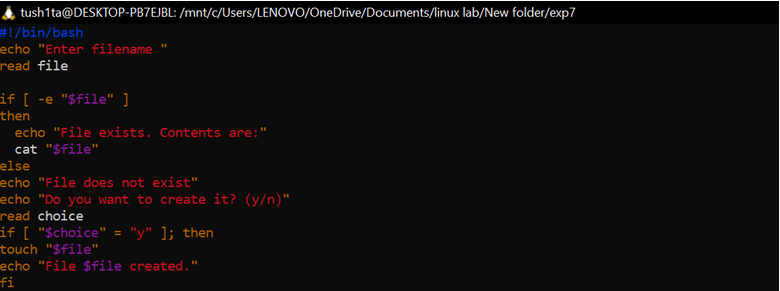
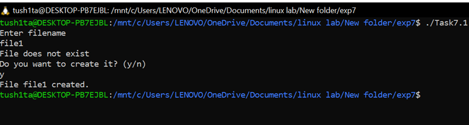
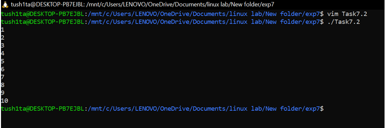
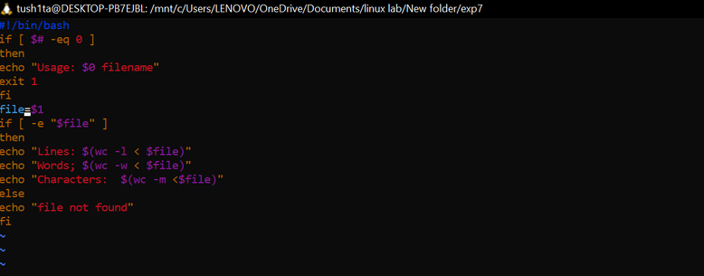
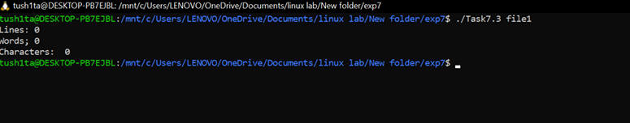
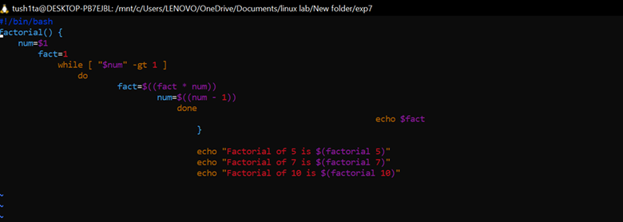
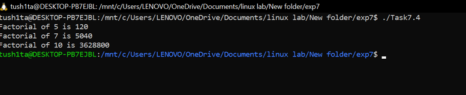

EXPERIMENT 7 - Shell Programming
================================

Aim
---

**To understand and practically apply process management commands, viewing and monitoring processes, terminating, process priortization and scheduling**

* * *

Tools & Software Used
---------------------

* **Terminal Emulator:** GNOME Terminal
* **Shell:** Bash (_Bourne-Again Shell_)

* * *

Basic Process Commands
======================

#### 1.  `ps`  - shows currently running processes

#### 2.  `top`  - shows running processes dynamically with their CPU and memory usage

#### 3.  `pstree`  - shows process hierarchy

#### 4.  `kill<PID>`  - stops the proccess

Process Priotization
====================

#### 1.  `nice -n <value> command`  - starts a process with a specific priority

#### 2.  `renice <value> - p <PID>`  - change priority of a runnung process

Process Scheduling
==================

#### 1.  `at <TIME>`  - schedules one time tasks (_works only with mins, hours & days_)

#### 2.  `cron`  - runs specific tasks at given time / dates

* * * * * command
          │  │  │  │  │
          │  │  │  │  └── Day of week (0–6, Sunday=0)
          │  │  │  └──── Month (1–12)
          │  │  └─────── Day of month (1–31)
          │  └────────── Hour (0–23)
          └───────────── Minute (0–59)
          
          

LAB Exericeses
==============

TASK 1: File existence Check
============================

#### Script:

#### 

#### Output:

TASK 2: Print no.'s from 1 to 10
================================

#### Output:

    

TASK 3: Count lines, words and characters in a file
===================================================

#### Script:

#### Output:

TASK 4: Factorial of a number using funtion
===========================================

#### Script:

#### Output:

OBSERVATIONS
============

* Successfully viewed running processes using ps, top, and pstree.

* Able to terminate processes using kill and control their priority with nice and renice.

* Scheduled tasks using at for one-time execution and cron for recurring jobs.
  
  

CONCLUSION
==========

The experiment enhanced understanding of Linux process management and scheduling.
