EXPERIMENT 8 - Shell Programming
================================

* * *

Name: Vivek Chauhan SAP id:590029184 Date:29/09/2025

* * *

Aim
---

**To understand and demonstrate the concepts of process control and signals, process monitoring and resource usage, process communication and synchronization, background processes and job control, and system monitoring and logging in Linux**

* * *

Tools & Software Used
---------------------

* **Operating System:** Ubuntu running on Oracle VirtualBox
* **Terminal Emulator:** GNOME Terminal
* **Shell:** Bash (_Bourne-Again Shell_)

* * *

Process Control & signals
=========================

#### -  `kill`  - used to terminate or send signals to processes

#### Syntax:

      kill [options] <PID>

#### Signals (used as options):

1. `2`  - **SIGINT** (_interrupt_)
2. `15`  - **SIGTERM** (_termiante gracefully_)
3. `9`  - **SIGKILL** (_force kill_)
4. `19`  - **SIGSTOP** (_Stops a process_)
5. `18`  - **SIGCONT** (_resumes the stopped process_)

#### OUTPUT:

 Process Monitoring and Resource Usage

1. `top`  - **live view of processes, CPU, memory**
   
   

#### OUTPUT:

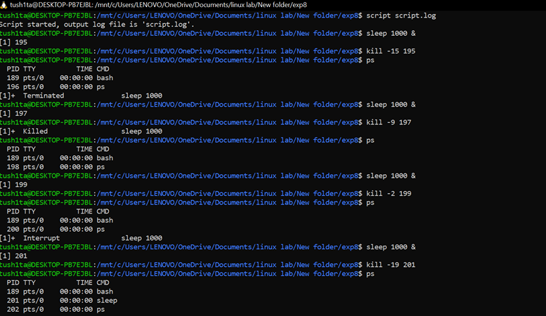

        

2. `htop`  - **user friendly version of _top_**

#### OUTPUT:

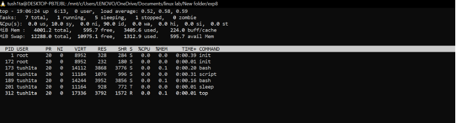

3. `ps aux`  - **snapshot of all processes**
   
   #### OUTPUT:
   

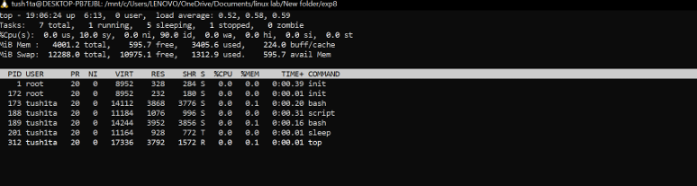

   
   `free -h`  - **show memory usage**

4. `uptime`  - **system load averages**

#### OUTPUT:

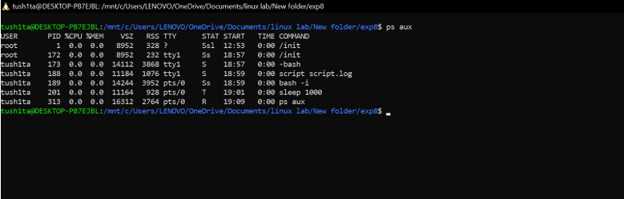

Process Communication
=====================

* **Pipes  `|`  - to pass output of one command to another**

#### OUTPUT:

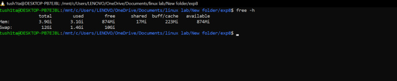

Process Synchronization
=======================

#### To prevent conflicts, processes can be synchronized

* `wait`  - **used to pause the execution of a script until all the background processes complete.**
  
  

     ## OUTPUT:
 

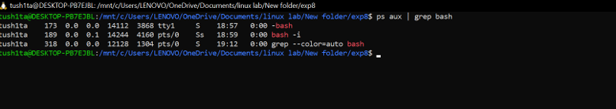

* `wait <PID>` - **waits for a particular job to finish**  
  
  

#### SCRIPT:

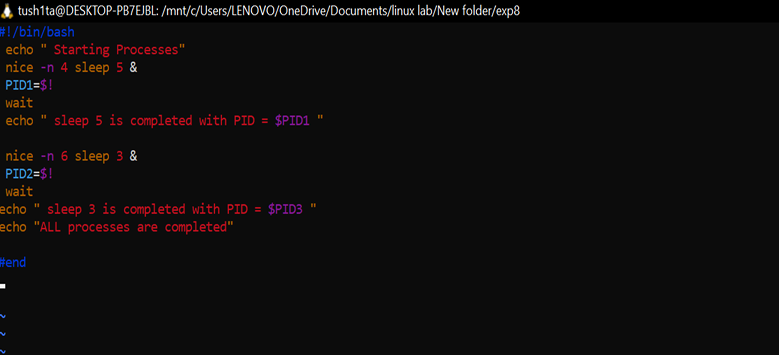

#### OUTPUT:

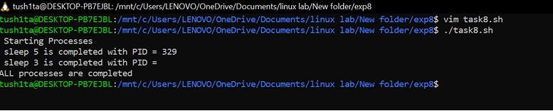

Background Process and Job control
==================================

1. `&`  - **used to run a process in background**
2. `jobs`  - **shows background jobs**
3. `fg %1`  - **brings job 1 to foreground**
4. `bg %1`  - **resume job 1 in background**

#### OUTPUT:

System Monitoring and logging
=============================

1. `dmesg | less`  - **kernel/ system messages**

#### OUTPUT:

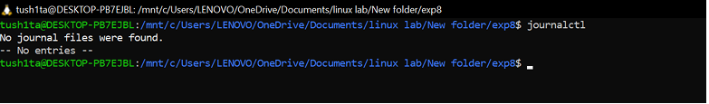

2. `journalctl`  - **systemlogs
   
   #### OUTPUT:

3. `journalctl`  - **systemlogs**
   
   OUTPUT: 
   
   

4. `who`  or  `w`  - **user currently logged-in**

#### OUTPUT:

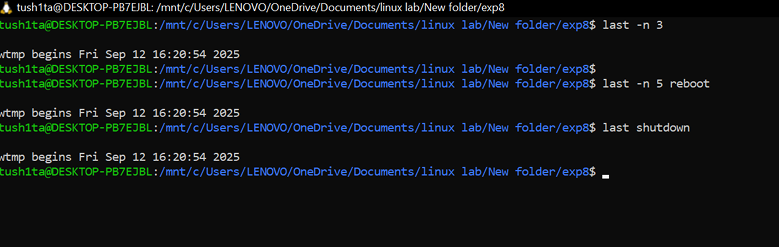

LAB Exericeses
==============

TASK 1: Check File Permissions
==============================

**Write a script that checks the file permissions of a given file and displays whether it is readable, writable, or executable by the current user.**  

#### Script:

#### Output:

TASK 2: String Operations
=========================

**Create a script that prompts the user to enter a string and then performs operations like string length, string concatenation, and string comparison.**  

#### Script:

#### Output:

TASK 3: Search for a Pattern in a file
=====================================

**Write a script that searches for a specific pattern in a given file and displays the matching lines.**

#### Output:

TASK 4: Display System Information
==================================

**Create a script that displays various system information like the current date and time, logged-in users, system uptime, etc.**

#### Output:

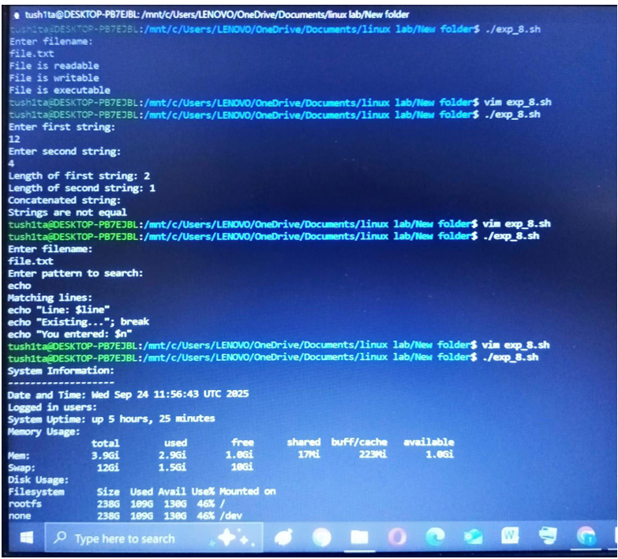

OBSERVATIONS
============

* `kill`, `wait` and job control commands (`&`, `jobs`, `fg`, `bg`) worked as expected.

* `top`, `htop`, `ps aux`, and `free -h` provided real-time process and resource information.

* Pipes (`|`) enabled inter-process communication.

* System monitoring commands (`dmesg`, `journalctl`, `last`, `who`) displayed logs and user activity correctly.

* Lab exercises executed successfully with expected outputs.

* * *

CONCLUSION
==========

* The experiment demonstrated process control, monitoring, communication, and synchronization in Linux.

* Background job management and system monitoring help efficiently manage processes.

* Shell scripting with process commands enables effective automation and resource tracking.
