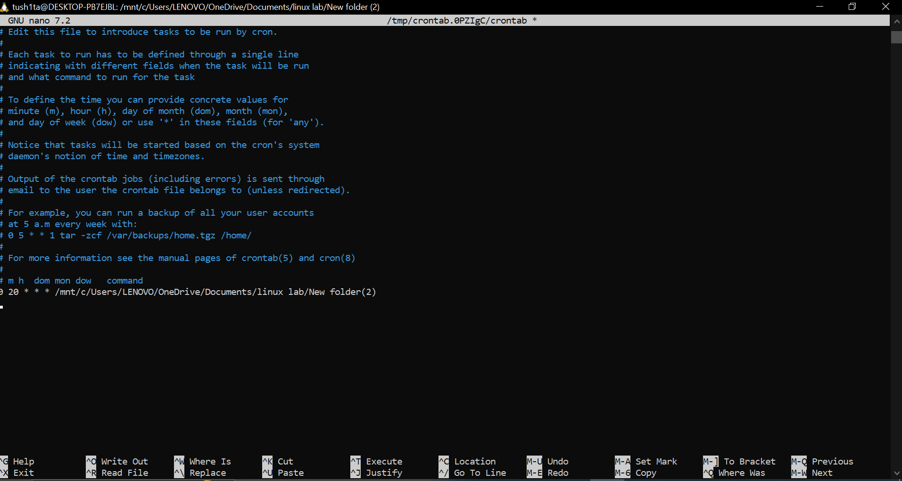

## Experiment: [Daily System Logger Script]
### Name: Tushita Sharma, Roll No.: 590029121 Date: 2025-10-15

### AIM:
* To create a shell script that logs current system information, rotates old logs, and schedules itself to run daily.

### Requirements:
* Any Linux Distro(kali)
* Any text editor (VS Code, Vim, Nano, etc.)  
* Cron service for scheduling  


### Theory:
In system administration, automated logging is crucial for monitoring system performance, diagnosing issues, and maintaining records.  
This experiment involves:
1. Logging details like username, date, processes, and disk usage.  
2. Archiving old logs automatically.  
3. Scheduling the script to run daily using `cron`.


### Procedure & Observations

#### **Exercise 1: Creating the Daily Log Script**

##### **Task Statement:**
Write a shell script that logs system info and handles automatic rotation of old logs.

##### **Explanation:**
This script:
- Identifies the current user.  
- Creates a directory for storing logs.  
- Saves daily logs with timestamps.  
- Archives logs older than 7 days.  
- Can be scheduled using a cron job.  

##### **Command(s):**

```bash
#!/bin/bash
SYS_D="$HOME/daily_logs"
ARCHIVE_DIR="$SYS_D/archive"
mkdir -p "$ARCHIVE_DIR"


LOG_FILE="$SYS_D/log_$(date +%Y-%m-%d).txt"


{
  echo "============================="
  echo "System Log for: $(date)"
  echo "User: $(whoami)"
  echo "============================="
  echo
  echo "Uptime:"
  uptime
  echo
  echo "Top 5 CPU-consuming processes:"
  ps -eo pid,comm,%mem,%cpu --sort=-%cpu | head -n 6
  echo
  echo "Disk Usage:"
  df -h
} > "$LOG_FILE"


find "$SYS_D" -name "log_*.txt" -mtime +7 -exec mv {} "$ARCHIVE_DIR" \;


if [ "$(date +%u)" -eq 7 ]; then
  tar -czf "$ARCHIVE_DIR/weeklylogs_$(date +%Y-%m-%d).tar.gz" -C "$ARCHIVE_DIR" .
fi
```
## Output Example:

<p align="center">

</p>

---
## Exercise 2: Scheduling the Script
## Task Statement:
Schedule the above script to run daily using cron.

## Explanation:
Use crontab to automate the script execution at a fixed time every day.

## Command(s):
bash
crontab -l
Use date +%Y-%m-%d for file naming.

Use find . -name "log_*.txt" -mtime +7 to identify old files.

Check system storage with df -h.

For archiving, use tar -czf weeklylogs_$(date +%Y-%m-%d).tar.gz.

Store archives in ~/daily_logs/archive.

## Scheduling(cron job)
Using crontab -e to schedule the script to run everyday at a fixed time.
eg.
```
0 20 * * * /mnt/c/Users/LENOVO/OneDrive/Documents/linux lab/New folder (2)
```
<p align="center">

</p>


## Result:
The script successfully logs daily system information, archives logs older than 7 days, and schedules itself to run daily using a cron job.


